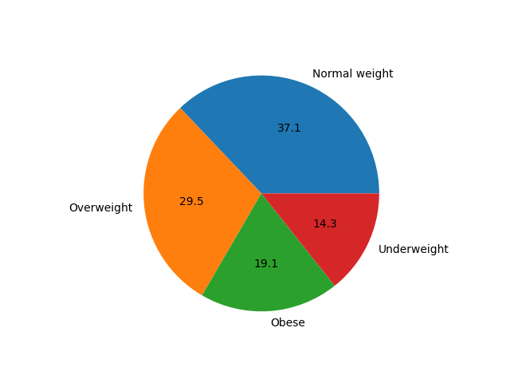
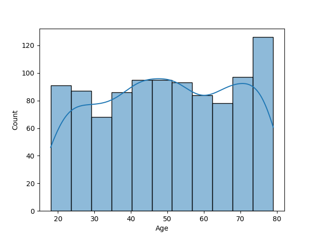
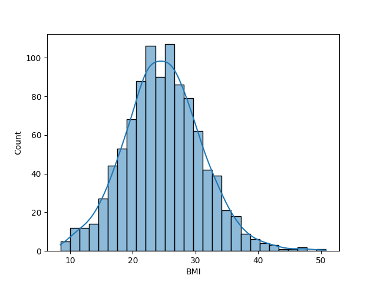
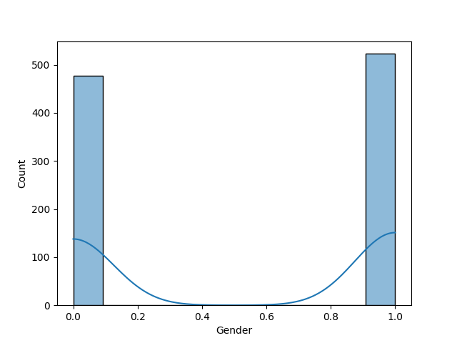
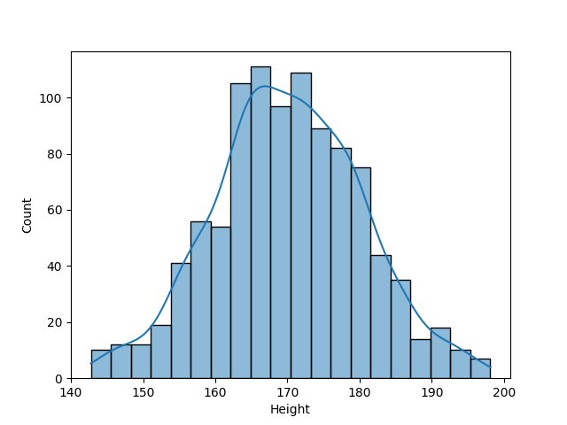
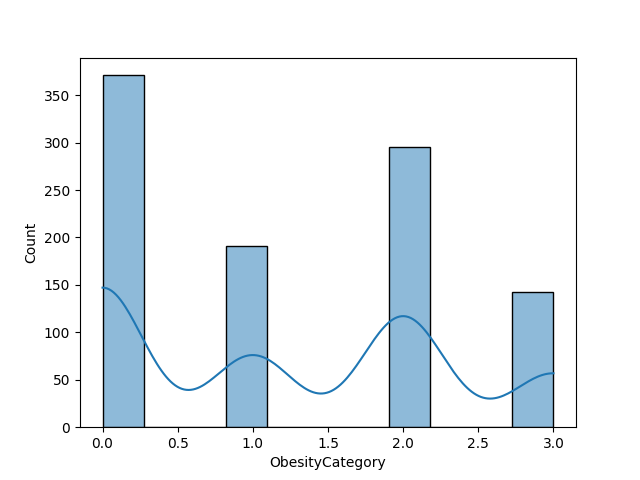
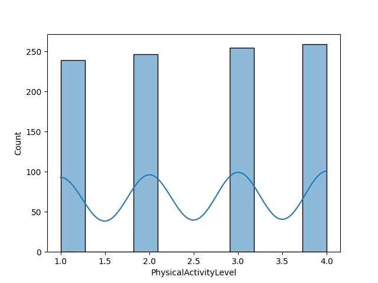
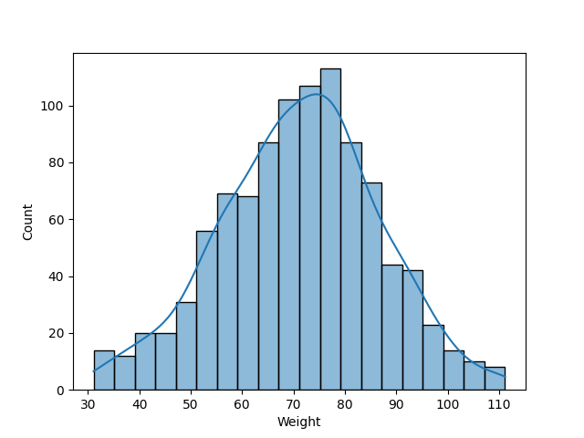

# 🩺 Obesity Prediction using Machine Learning

## 📌 Overview
This project predicts a person’s **obesity category** based on their age, gender, height, weight, BMI, and physical activity level.  
It uses a trained **machine learning model** (saved as `model.pkl`) and label encoders (`encoder.pkl`) for categorical features.  

The application is built with **Streamlit** for interactive predictions and a **Jupyter Notebook** (`code.ipynb`) for model training, analysis, and visualization.

---

## 🚀 Features
- 📊 Data preprocessing & visualization (`code.ipynb`)
- 🤖 Machine learning model training & evaluation
- 🌐 Streamlit web app for real-time predictions
- 📈 Visualizations to understand dataset distribution

---

## 🛠️ Installation & Setup

1. Clone the repository:
   ```bash
   git clone https://github.com/subhiksha-kodi/END-TO-END-DS-PROJECT--OBESITY-PREDICTION.git
   cd obesity-prediction
   ```

2. Install dependencies:
   ```bash
   pip install -r requirements.txt
   ```

3. Run the Streamlit app:
   ```bash
   streamlit run app.py
   ```

---

## 📂 Project Structure
```
├── app.py                  # Streamlit application
├── code.ipynb              # Jupyter Notebook for training & EDA
├── model.pkl               # Trained ML model
├── encoder.pkl             # Encoders for categorical features
├── plots/                  # Visualizations
│   ├── pie.png
│   ├── Age.png
│   ├── BMI.png
│   ├── Gender.png
│   ├── Height.png
│   ├── ObesityCategory.png
│   ├── PhysicalActivityLevel.png
│   └── Weight.png
└── README.md               # Project documentation
```

---

## 📊 Visualizations

### 🔹 Class Distribution


### 🔹 Feature Distributions
- **Age**  
  

- **BMI**  
  

- **Gender**  
  

- **Height**  
  

- **Obesity Category**  
  

- **Physical Activity Level**  
  

- **Weight**  
  

---

## 🎯 Usage (Streamlit App)

1. Enter details:
   - Age  
   - Gender  
   - Height (cm)  
   - Weight (kg)  
   - BMI  
   - Physical Activity Level  

2. Click **Predict** to get your **Obesity Category**.

---

## 🧠 Model Training
- Feature Engineering and preprocessing are done in **`code.ipynb`**
- Encoders handle categorical variables (`Gender`, `ObesityCategory`)
- Trained model stored in **`model.pkl`**

---

## 📌 Example Prediction
If you enter:  
- Age: `25`  
- Gender: `Male`  
- Height: `175 cm`  
- Weight: `75 kg`  
- BMI: `24.5`  
- Physical Activity Level: `3`  

👉 The app will predict your **Obesity Category**.

---

## 📜 License
This project is licensed under the **MIT License**.

---
